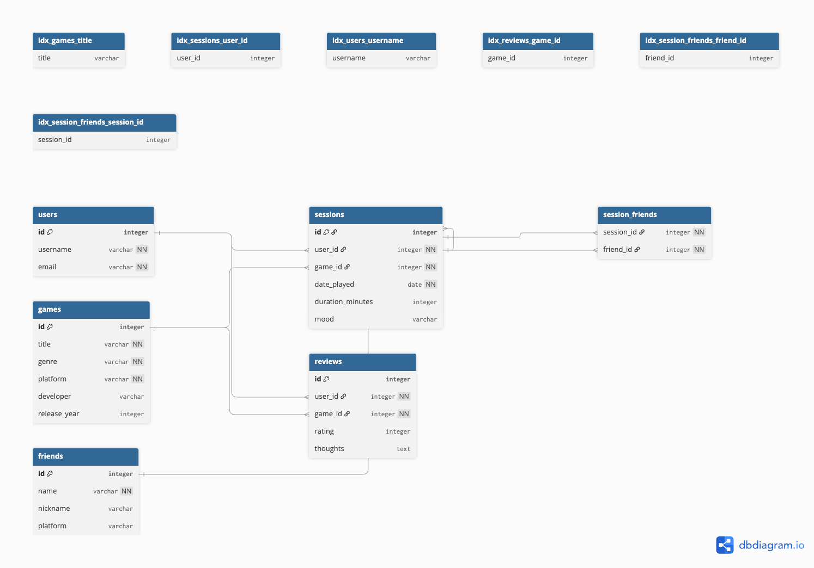

# Design Document

By Aditya

---

## Scope

The database for the Gamer Journal project includes all entities necessary to help users track their personal gaming history, moods during gameplay, game reviews, and who they played with during those sessions. Included in the database's scope are:

- Users, including basic identifying information
- Games, with metadata like genre, platform, and release year
- Friends, representing people a user played with
- Gaming sessions, which include mood, time played, and game played
- Reviews, representing thoughts and ratings of a game
- Session-friend mappings, linking friends to specific play sessions

**Outside the scope** are features like:
- In-game statistics or achievements
- Multiplayer match data or scoreboard tracking
- Completion progress or walkthrough details
- Account authentication, login, or media uploads

---

## Functional Requirements

This database will support:

- Creating, reading, updating, and deleting users, games, friends, sessions, and reviews
- Linking multiple friends to a single gaming session
- Querying reviews by user or by game
- Viewing a user’s gaming history or sessions involving a specific game
- Analyzing average game ratings

In this iteration, the system will **not** support:
- Uploading or storing videos, screenshots, or save files
- Social networking (e.g., friend requests, messaging)
- User authentication or passwords

---

## Representation

Entities are captured in SQLite tables with appropriate primary keys, foreign keys, and constraints.

### Entities

#### Users

- `id`: Primary key, `INTEGER AUTOINCREMENT`
- `username`: `TEXT NOT NULL UNIQUE`
- `email`: `TEXT NOT NULL UNIQUE`

#### Games

- `id`: Primary key, `INTEGER AUTOINCREMENT`
- `title`: `TEXT NOT NULL`
- `genre`: `TEXT NOT NULL`
- `platform`: `TEXT NOT NULL`
- `developer`: `TEXT`
- `release_year`: `INTEGER`, with a `CHECK` constraint to ensure values are after 1950

#### Friends

- `id`: Primary key, `INTEGER AUTOINCREMENT`
- `name`: `TEXT NOT NULL`
- `nickname`: `TEXT` (optional)
- `platform`: `TEXT` (e.g., Steam, PSN)

#### Sessions

- `id`: Primary key, `INTEGER AUTOINCREMENT`
- `user_id`: Foreign key to `users(id)`
- `game_id`: Foreign key to `games(id)`
- `date_played`: `DATE NOT NULL`
- `duration_minutes`: `INTEGER` with `CHECK (duration_minutes > 0)`
- `mood`: `TEXT` with `CHECK (mood IN ('happy', 'neutral', 'sad'))`

#### Reviews

- `id`: Primary key, `INTEGER AUTOINCREMENT`
- `user_id`: Foreign key to `users(id)`
- `game_id`: Foreign key to `games(id)`
- `rating`: `INTEGER` with `CHECK (rating BETWEEN 1 AND 10)`
- `thoughts`: `TEXT` (optional)

#### Session_Friends

- `session_id`: Foreign key to `sessions(id)`
- `friend_id`: Foreign key to `friends(id)`
- Composite primary key: (`session_id`, `friend_id`) to ensure no duplicate links

---

## Relationships

The following diagram visually illustrates how the entities in the Gamer Journal database are related:

### Explanation:

- A **user** can have many **sessions** and write many **reviews**
- A **game** can be played in multiple **sessions** and reviewed by many **users**
- A **session** can include multiple **friends** (via the `session_friends` join table)
- A **friend** can participate in multiple **sessions**

This structure supports detailed tracking of play history, co-op gaming sessions, moods, and game impressions.

---

## Optimizations

Indexes have been added to support performance on expected query patterns:

- `users(username)` — for quick lookups of a user's data
- `games(title)` — for filtering or sorting game data
- `sessions(user_id)` — to query a user’s session history
- `reviews(game_id)` — for review aggregation and filtering
- `session_friends(session_id)` and `session_friends(friend_id)` — for efficient many-to-many querying

These indexes optimize performance for the most common `JOIN` and `WHERE` conditions in `queries.sql`.

---

## Limitations

This database assumes one review per user per game, one mood per session, and no media upload capabilities. It’s built for structured text-based journaling, not for storing real-time data or game files.

### Limitations of the design:
- Does not track game completion or progress
- Cannot store rich media (screenshots, videos)
- Mood is limited to 3 values (happy, neutral, sad)
- Only one review per user per game
- Does not support multiple moods or feelings per session

### Possible improvements:
- Add mood scale (e.g., 1–5) or emoji ratings
- Store multiple reviews per game per user (with timestamps)
- Include session notes and personal journaling
- Track game completion status and time to finish
- Enable tagging of games with categories or themes

---
