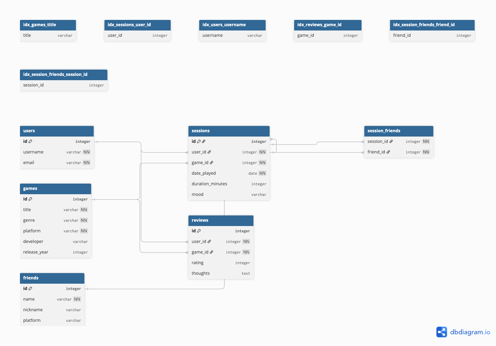

# 🎮 Gamer Journal – CS50 SQL Final Project

This is my final project for [CS50's Introduction to Databases with SQL](https://cs50.harvard.edu/sql/).  
The **Gamer Journal** is a personal logging system that allows users to track their gaming sessions, moods during play, friends they gamed with, and their reviews of games.

---

## 📂 Project Structure

| File | Description |
|------|-------------|
| `DESIGN.md` | Full design document describing scope, entities, schema, relationships, optimizations, and limitations |
| `schema.sql` | SQL file to create all tables, foreign keys, constraints, and indexes |
| `queries.sql` | Sample SQL queries to insert, retrieve, and analyze data |
| `ER_Diagram_Gaming.png` | Entity-Relationship Diagram for the database schema |

---

## 🧠 Features

- Add users and friends
- Store detailed metadata about games (genre, platform, release year, etc.)
- Record gameplay sessions with:
  - Date
  - Duration
  - Mood (happy, neutral, sad)
  - Game played
  - Friends present
- Write game reviews with a 1–10 rating and optional thoughts
- Query data such as:
  - All sessions for a user
  - All reviews for a game
  - Average game ratings
  - Sessions involving specific friends

---

## 🗃️ Database Schema Overview

- `users` – gamers with unique usernames and emails  
- `games` – game metadata  
- `friends` – people the user played with  
- `sessions` – gameplay logs linked to users and games  
- `reviews` – user-submitted game reviews  
- `session_friends` – join table to map multiple friends to a single session  

---

## 🖼️ ER Diagram



---

## 🧪 Sample Queries (from `queries.sql`)

```sql
-- Add a new user
INSERT INTO users (username, email)
VALUES ('aditya', 'aditya@example.com');

-- Log a gaming session
INSERT INTO sessions (user_id, game_id, date_played, duration_minutes, mood)
VALUES (1, 2, '2025-07-16', 90, 'happy');

-- Review a game
INSERT INTO reviews (user_id, game_id, rating, thoughts)
VALUES (1, 2, 9, 'Incredible story and combat system!');
```

---

## 🚫 Limitations

- Does not track game completion status or in-game stats  
- Mood tracking is limited to 3 predefined values  
- Each user can submit only one review per game  
- No media uploads (screenshots, videos)

---

## 🧱 Future Improvements

- Add mood scale (1–5) or emoji system  
- Allow multiple reviews per game per user (with timestamps)  
- Add tagging and categories for games  
- Track game completion or in-game milestones  
- Add journaling notes per session

---

## 👨‍💻 Author

Built by **Aditya Chunduri**  
GitHub: [@Chunduri-Aditya](https://github.com/Chunduri-Aditya)

---

## 📜 License

This project is part of the [CS50 SQL course](https://cs50.harvard.edu/sql/)
